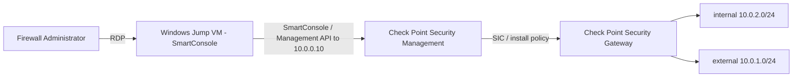

# Check Point Firewall — Administration & Policy Management (Lab 01)

Welcome to your Check Point firewall hands-on skills assessment. This environment gives you a live Check Point CloudGuard Security Management server and Security Gateway, plus a Windows jump VM with **Check Point SmartConsole** installed. Read this page, then move to **Exercise 1** to begin.

### Overall Estimated timing: 150 Minutes

## Overview

In this assessment you act as the **firewall administrator** responsible for operating a Check Point CloudGuard environment. From a Windows jump VM you use **SmartConsole** (the Check Point management GUI) and the **Management REST API** to build and manage the security policy: you create and publish objects, add access rules to the rulebase, introduce a policy layer with Application & URL Filtering, configure SSH logging/alerting, analyze events with SmartLog/SmartEvent, and produce a compliance report. You are graded on the **state of the published Check Point policy** (verified through the Management API, with the GUI-only steps confirmed by inspection).

## Objectives

By the end of this assessment you will have:

1. **Operated SmartConsole** — created and published a host object.
2. **Managed the security rulebase** — added a published access rule.
3. **Introduced a policy layer with Application Control** — an access layer with Application & URL Filtering enabled.
4. **Configured SSH access logging/alerting** — a rule controlling SSH with Track set to Log or Alert.
5. **Analyzed events** with SmartLog / SmartEvent over the resulting traffic logs.
6. **Produced a compliance report** using the Compliance blade.

## Pre-requisites

Working knowledge of Check Point administration: **SmartConsole** operation (sessions, publish, install policy); the **Security Management** server and **Security Gateway** roles; the **access policy / rulebase** (objects, rules, services, actions, tracking); **policy layers** and **Application & URL Filtering** (Application Control); firewall **logging**, **SmartLog** and **SmartEvent**; the **Compliance** software blade; and the Check Point **Management API** (`mgmt_cli` / the `web_api` REST interface).

## Architecture

A Check Point **Security Management** server runs the Management API; a **Security Gateway** enforces the policy installed from it. You drive everything from a Windows jump VM that has SmartConsole installed: you RDP to the jump VM, then SmartConsole (and the Management API) connect to the management server at `10.0.0.10`. The management server pushes policy to the gateway over Secure Internal Communication (SIC). The CloudLabs validators run on the jump VM and query the Management API to inspect your published configuration.

## Getting Started with the lab

Your virtual machine and this **Guide** are available within your web browser. Use the **Split Window** button at the top-right to open the guide beside your desktop session.

## Accessing Your Lab Environment

1. Connect to the Lab VM over RDP using the details on the **Environment** tab.

    - **RDP command:** see the **LABVM RDP Command** output on the **Environment** tab
    - **Username:** see the **LABVM Admin Username** output on the **Environment** tab
    - **Password:** see the **LABVM Admin Password** output on the **Environment** tab

1. Launch **SmartConsole** from the **Desktop shortcut** (or Start Menu) on the jump VM and connect it to the Security Management server. The gateway `cp-gw` is already onboarded over SIC with a baseline policy installed, so you can begin building policy immediately:

    - **Management server / SmartConsole target:** `10.0.0.10`
    - **Management username:** `admin`
    - **Management password:** `Chkp@12345`
    - **Management API base:** `https://10.0.0.10/web_api`
    - SmartConsole download portal (if you need to (re)install): `https://10.0.0.10`

1. If you need the Azure portal at any point, sign in with the credentials below:

    - **Email/Username:** <inject key="AzureAdUserEmail"></inject>

    - **Password:** <inject key="AzureAdUserPassword"></inject>

1. Your environment id for this run is **<inject key="DeploymentID" enableCopy="false"/>** — quote it if you contact support.

### Environment Details

- A Check Point **Security Management** server (CloudGuard) at **`10.0.0.10`**, running the **Management API** at **`https://10.0.0.10/web_api`** (admin / `Chkp@12345`).
- A Check Point **Security Gateway** that enforces the policy installed from the management server over SIC.
- A **Windows jump host** (`labvm-<DeploymentID>`) with **SmartConsole** installed (Desktop / Start Menu shortcut), on the management subnet so it can reach `10.0.0.10`.

## Track Your Progress

Use the **Validate** button on each task to check your work. The **Progress** tab shows your validation score; it reaches 100% when all task validations pass. Remember to **Publish** your SmartConsole session (and install policy where relevant) before you validate — the validators read the published configuration through the Management API.

## Lab Duration Extension

You have **150 minutes** for this assessment. If you need more time, click the **Hourglass** icon in the top-right of the lab environment (it appears when 10 minutes remain) and click **OK**.

## Support Contact

The CloudLabs support team is available 24/7 via email and live chat.

- Email Support: cloudlabs-support@spektrasystems.com
- Live Chat Support: https://cloudlabs.ai/labs-support

Click **Next** to begin Exercise 1.

## Happy Assessing !!
